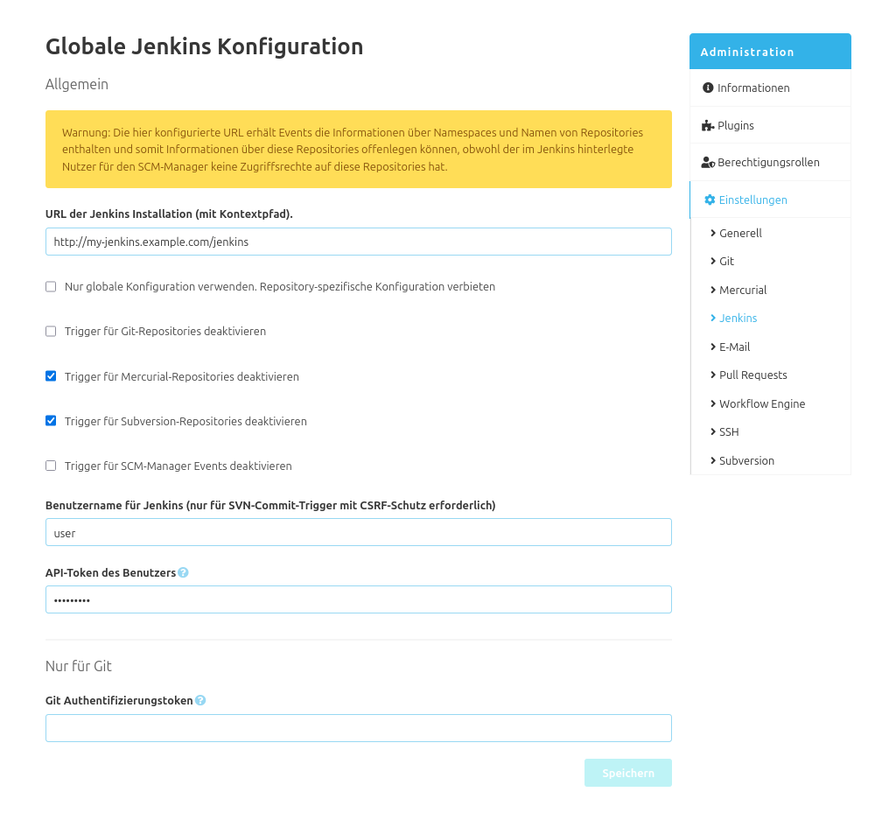

Wie im SCM-Manager 2 üblich, gibt es eine globale und eine repository-spezifische Konfiguration für das Jenkins-Plugin.

### Globale Konfiguration
Über die globale Jenkins Konfiguration lassen sich die Jenkins Instanz-URL und die VCS Trigger konfigurieren. 
Außerdem kann dort die repository-spezifische Konfiguration deaktiviert werden.

#### Repository Konfiguration
Über die Repository Konfiguration des SCM-Jenkins-Plugin können die Builds des Repositories gesteuert werden. 
Dazu wird die Jenkins Instanz-URL und der Name des Projekts benötigt. 
Weiterhin kann man über unterschiedliche Zugangsdaten eine Verbindung mit einer gesicherten Jenkins Instanz herstellen. 
Es gibt die Möglichkeit einen Authentifizierungstoken oder einen API Token passend zum Benutzer für die Verbindung zu verwenden. 
Über die Branches lässt sich zusätzlich steuern, welche Repository Branches nach einem Push zum Bauen auf dem Jenkins getriggert werden sollen.

