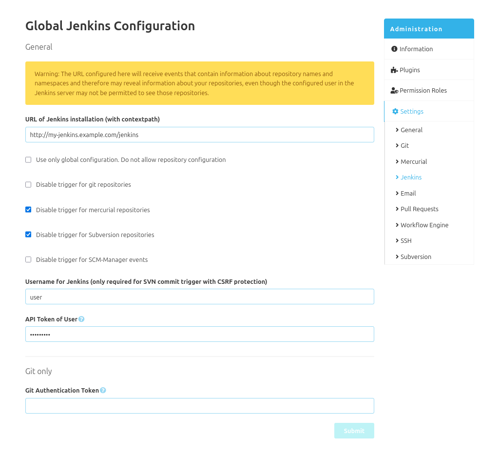
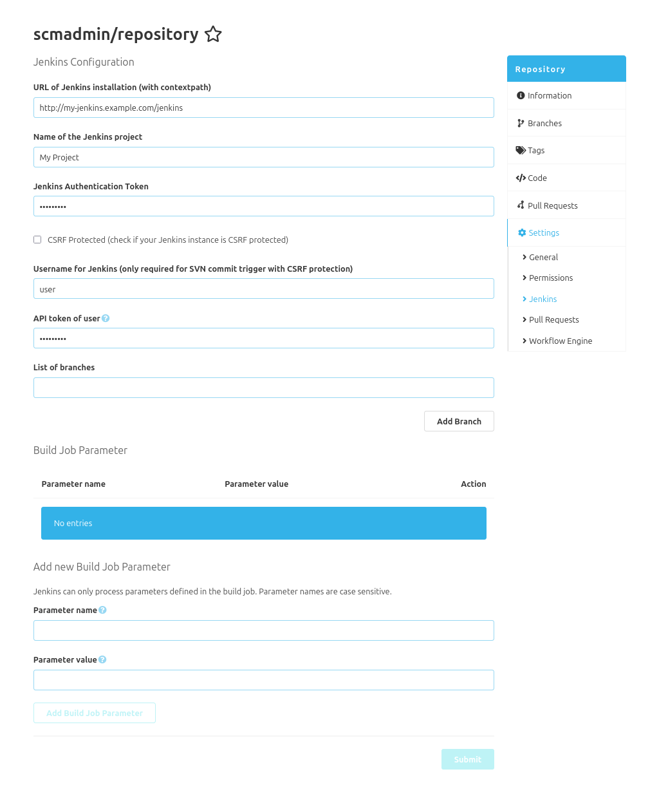

There are two quite different configurations for the SCM-Jenkins-plugin.

### Global configuration
In the global configuration you can set the Jenkins instance url and configure the VCS triggers.
Depending on your Jenkins configuration, you may have to set a username and a valid API token for
this user, too. This is used for the CSRF protection in Jenkins. Additionally, for git a
"notifyCommit access tokens" is needed. This can be created in the global security configuration
in Jenkins.

Finally it is possible to disable the repository specific configuration or to disable event triggers for specific
repository types.

#### Repository Configuration
With the repository configuration, build jobs for single repositories can be controlled.
Just the Jenkins instance url and some kind of credentials are required. 
For authentication, you may have to use an authentication token (for example for git the "notifyCommit access token")
and/or a username with an api token. 

You can filter the build job triggers by branches, so only build jobs of selected branches will be triggered on a repository push.

If the Jenkins build job is parametrized you may also send parameters with each request.
The parameters consist of name and value pairs. The name must match the parameter name in the Jenkins build job exactly (case sensitiv).
The values may be absolute or relative values. Absolute values are for example `Trillian` as string parameter or `true` as boolean parameter.
The relative values can be used through an expression language from the repository push context (repository, commits).
It could be used like `${repository.id}` for the repository id or `${commit.author.mail}` to get the mail address from the committer.

